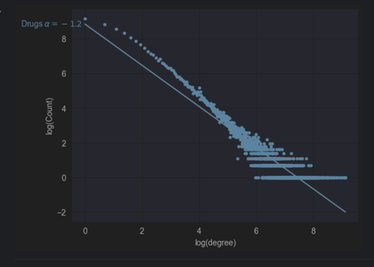

# Final Project for Graphs Machine Learning Course
The idea is to take the data from FDA Adverse Event Reporting System [(FAERS)](https://fis.fda.gov/extensions/FPD-QDE-FAERS/FPD-QDE-FAERS.html)
and to build a graph for drags and their reactions, then analyze the data using learned techniques, and machine learning. 

# Dataset Description and Explanation
The dataset used in this analysis comes from the FDA Adverse Event Reporting System (FAERS). It consists of quarterly data files for the years 2021, 2022, 2023, 2024 (Q1, Q2, Q3).
The data is structured to represent relationships between drugs and adverse reactions.
Originally provided as XML, that contains more information, I cleaned the data and saved as csv, and left only the relevant information with 3 columns: 
DRUG: The name or identifier of the drug
REACTION: The observed adverse reaction
DRUG_TYPE: Drug type (unknown if not reported)
Usage of the data to construct a bipartite graph where drugs and reactions are represented as nodes, and the edges between them represent reported associations.

# Model and Graph Dissection
Graph Construction: The core of the analysis revolves around a bipartite graph constructed using the NetworkX library. The function build_bi_partite_graph is used to create this graph from the dataset.
## Feature Engineering: 
Several graph-based features are computed for each drug-reaction pair:
•	Jaccard coefficient
•	Adamic-Adar index
•	Preferential attachment
•	Common neighbors count
•	Resource allocation index
These features capture various aspects of the network structure and are used as inputs for the predictive model.
Model: The primary model used is CatBoostClassifier, a gradient boosting algorithm that handles categorical features effectively. The model is configured with the following parameters:
•	n_estimators: 500
•	learning_rate: 0.001
•	depth: 12
•	eval_metric: "AUC"
•	loss_function: "Logloss"
•	l2_leaf_reg: 4
•	Other parameters related to verbosity and early stopping.

The model is trained to predict the likelihood of an edge (i.e., a drug-reaction association) existing in the graph.
Graph Construction: The graphs are constructed using the NetworkX library, enabling complex network analysis. Key functions involved in graph construction include:
•	build_bi_partite_graph: Used to create bipartite graphs from the dataset, separating nodes into two sets (e.g., drugs and reactions).
•	Graph analysis metrics, such as Jaccard Coefficient, Adamic-Adar Index, and Preferential Attachment, are computed to understand the relationships and predict potential new edges in the graph.

# Compare to another models
The graph is distributed as preferential attachment model proposed by Albert Barabasi

# Results
See in drugs_analysys.ipynb

Training on 2021, 2022, 2023, validation 2024
For random chosen drug "XOLAIR" we can see that the model predicted 2561 reactions, 127 from them are really observed in the dataset of 2024, and 127 of them are false positive
AUC = 0.82

# Conclusions
Based on the implementation and evaluation methods used, we can draw the following conclusions:
1.	Graph-based approach: The use of a bipartite graph to represent drug-reaction associations provides a rich framework for analysis, allowing for the computation of various network-based features.
2.	Predictive power: The CatBoost model, trained on graph-derived features, appears to be capable of predicting new drug-reaction associations. This is evidenced by the use of AUC as an evaluation metric and the generation of ROC curves.
3.	Interpretability: The use of well-known graph metrics as features allows for some level of interpretability in the model's predictions.
4.	Validation strategy: The use of a separate validation set (2021 Q4 data) helps ensure that the model's performance is assessed on unseen data, providing a more reliable estimate of its generalization capability.
5.	Potential for drug safety applications: This model could potentially be used to predict previously unknown adverse reactions to drugs, which could be valuable for pharmacovigilance and drug safety monitoring.
However, it's important to note that further analysis of the model's performance across different drugs and reactions would be necessary to fully understand its strengths and limitations. Additionally, careful consideration should be given to potential biases in the reporting system that generates the FAERS data.

# References:
A Probabilistic Approach for Collective Similarity-based Drug-Drug Interaction Prediction:
https://linqs.org/assets/resources/sridhar-bio16.pdf

